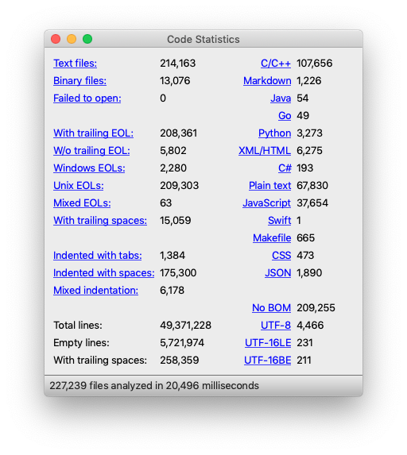

# Code Analyzer

Collects and displays various statistics about your source code.

Built-in file viewer automatically highlights questionable regions.

## License

[GNU General Public License v3.0](LICENSE.md)
